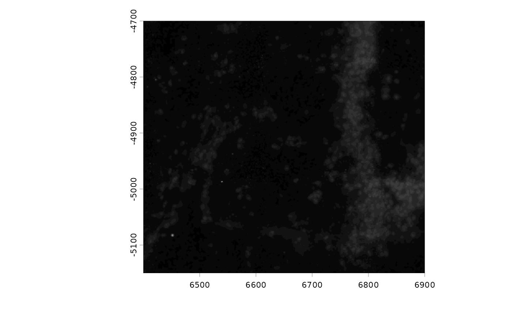
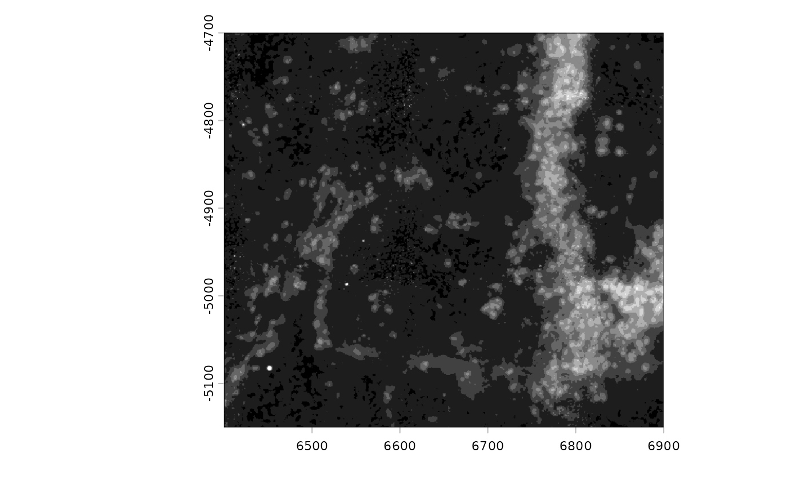
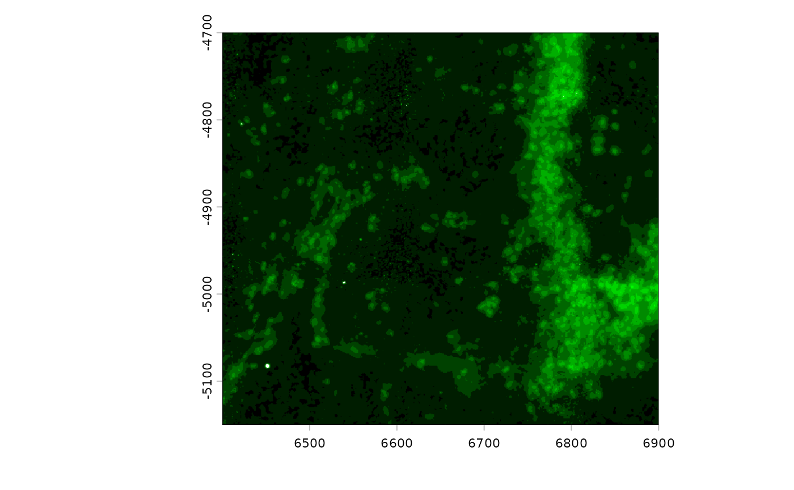
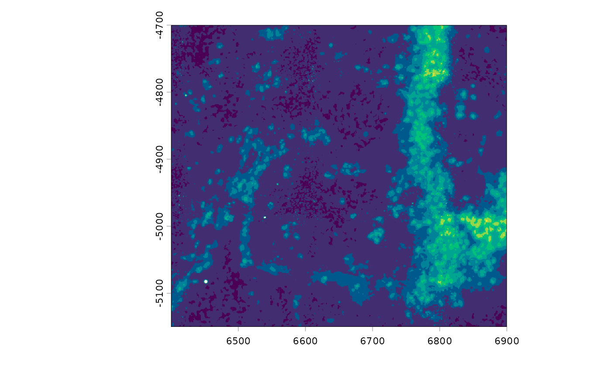

# Giotto image tools

## Giotto Image Tools

### 1. Overview

Giotto uses `giottoLargeImage` to represent images and raster
information. This is an S4 class built based on the *terra*
`SpatRaster`.

An older class called `giottoImage` based on the *magick* package also
exists, but is currently being phased out. Ideally, `giottoLargeImages`
will also be renamed to `giottoImage` afterwards, simplifying the naming
scheme.

The object structure of `giottoLargeImage`

    giottoLargeImage
    \- name                (object name)
    \- raster_object       (terra raster object)
    \- extent              (current spatial extent)
    \- overall_extent      (spatial extent of original image - experimental)
    \- scale_factor        (pixels per coordinate unit - experimental)
    \- resolution          (coordinate units covered per pixel)
    \- max_intensity       (approximate maximum intensity value)
    \- min_intensity       (approximate minimum intensity value)
    \- max_window          (value to set as maximum intensity in color scaling)
    \- colors              (vector of color mappings provided as hex codes)
    \- is_int              (whether values are integers)
    \- file_path           (filepath to the image)
    \- OS_platform         (operating system)

### 2. Sampling

Spatial images are often extremely large files. The high detail
(resolution), large spatial region captured, and precision of recorded
values (bitdepth) often results in files in the 10s of gigabytes. This
makes the full size images difficult to work with. One way to get around
this is to perform regular sampling of the image, touching only the
values of the original image that are needed generate a downscaled
representation. This is implemented in *terra* as `spatSample()`.

When plotting, *Giotto* optimizes the speed of this sampling by striking
a balance between
[`terra::crop()`](https://rspatial.github.io/terra/reference/crop.html)
and
[`terra::spatSample()`](https://rspatial.github.io/terra/reference/sample.html)
to try to prevent sampling from unnecessary regions, but also avoid
large crop operations on the fullsize image, which can be very costly.
This is done through `plot_auto_largeImage_resample()`

`giottoLargeImages` can also be resampled to other image formats
(`magick` and `EBImage`) in addition to `data.table` and `array` using
`GiottoClass:::.spatraster_sample_values()`

These two functions are experimental and they will be exported using
more common function names in the future.

### 3 Color scaling

[`distGiottoImage()`](https://giotto-suite.github.io/GiottoClass/reference/distGiottoImage.md)
can be used to look at the values present within a `giottoLargeImage`.
It is often the case that the values recorded within an image do not map
to the full set of values allowed by its bitdepth. *Giotto* plots images
by guessing the bitdepth based on the estimated maximum value detected.
This mapping may not always be optimal.

``` r

library(GiottoClass)
gimg <- GiottoData::loadSubObjectMini("giottoLargeImage", idx = 2)
gimg <- GiottoClass:::.update_giotto_image(gimg) # update older images that are missing slots

plot(gimg)
```



``` r

distGiottoImage(giottoLargeImage = gimg)
```


Since there are few values beyond 70, try setting `max_window` to 70 in
so that the color mapping better represents the available information.

``` r

gimg@max_window <- 70
plot(gimg)
```



``` r

# plot(gimg, max_intensity = 150) # can be used without setting the slot
```

The colormap to use for an image can also be edited. The default for a
greyscale image is a monochrome black to white. Other color scales can
be supplied. For monochrome colorscales:
[`getMonochromeColors()`](https://drieslab.github.io/GiottoUtils/reference/getMonochromeColors.html)

``` r

gimg@colors <- getMonochromeColors("green")
plot(gimg)
```



``` r

viridis_colors <- hcl.colors(256, palette = "viridis")
plot(gimg, col = viridis_colors) # can be used without setting the slot
```



#### TODOs:

- provide accessors for these slots  
- make *ggplot*-based plotting also obey these settings

``` r

sessionInfo()
```

    ## R version 4.6.0 (2026-04-24)
    ## Platform: x86_64-pc-linux-gnu
    ## Running under: Ubuntu 24.04.4 LTS
    ## 
    ## Matrix products: default
    ## BLAS:   /usr/lib/x86_64-linux-gnu/openblas-pthread/libblas.so.3 
    ## LAPACK: /usr/lib/x86_64-linux-gnu/openblas-pthread/libopenblasp-r0.3.26.so;  LAPACK version 3.12.0
    ## 
    ## locale:
    ##  [1] LC_CTYPE=C.UTF-8       LC_NUMERIC=C           LC_TIME=C.UTF-8       
    ##  [4] LC_COLLATE=C.UTF-8     LC_MONETARY=C.UTF-8    LC_MESSAGES=C.UTF-8   
    ##  [7] LC_PAPER=C.UTF-8       LC_NAME=C              LC_ADDRESS=C          
    ## [10] LC_TELEPHONE=C         LC_MEASUREMENT=C.UTF-8 LC_IDENTIFICATION=C   
    ## 
    ## time zone: UTC
    ## tzcode source: system (glibc)
    ## 
    ## attached base packages:
    ## [1] stats     graphics  grDevices utils     datasets  methods   base     
    ## 
    ## other attached packages:
    ## [1] GiottoClass_0.5.1
    ## 
    ## loaded via a namespace (and not attached):
    ##  [1] sass_0.4.10                 generics_0.1.4             
    ##  [3] SparseArray_1.12.2          gtools_3.9.5               
    ##  [5] lattice_0.22-9              digest_0.6.39              
    ##  [7] magrittr_2.0.5              evaluate_1.0.5             
    ##  [9] grid_4.6.0                  fastmap_1.2.0              
    ## [11] jsonlite_2.0.0              Matrix_1.7-5               
    ## [13] backports_1.5.1             GiottoData_0.2.16          
    ## [15] SingleCellExperiment_1.34.0 codetools_0.2-20           
    ## [17] textshaping_1.0.5           jquerylib_0.1.4            
    ## [19] abind_1.4-8                 cli_3.6.6                  
    ## [21] rlang_1.2.0                 XVector_0.52.0             
    ## [23] Biobase_2.72.0              cachem_1.1.0               
    ## [25] DelayedArray_0.38.1         yaml_2.3.12                
    ## [27] otel_0.2.0                  S4Arrays_1.12.0            
    ## [29] tools_4.6.0                 GiottoUtils_0.2.5          
    ## [31] checkmate_2.3.4             SpatialExperiment_1.22.0   
    ## [33] SummarizedExperiment_1.42.0 BiocGenerics_0.58.1        
    ## [35] R6_2.6.1                    magick_2.9.1               
    ## [37] matrixStats_1.5.0           stats4_4.6.0               
    ## [39] lifecycle_1.0.5             Seqinfo_1.2.0              
    ## [41] S4Vectors_0.50.1            fs_2.1.0                   
    ## [43] htmlwidgets_1.6.4           IRanges_2.46.0             
    ## [45] ragg_1.5.2                  desc_1.4.3                 
    ## [47] pkgdown_2.2.0               terra_1.9-27               
    ## [49] bslib_0.11.0                data.table_1.18.4          
    ## [51] Rcpp_1.1.1-1.1              systemfonts_1.3.2          
    ## [53] xfun_0.57                   GenomicRanges_1.64.0       
    ## [55] MatrixGenerics_1.24.0       knitr_1.51                 
    ## [57] rjson_0.2.23                htmltools_0.5.9            
    ## [59] rmarkdown_2.31              compiler_4.6.0
