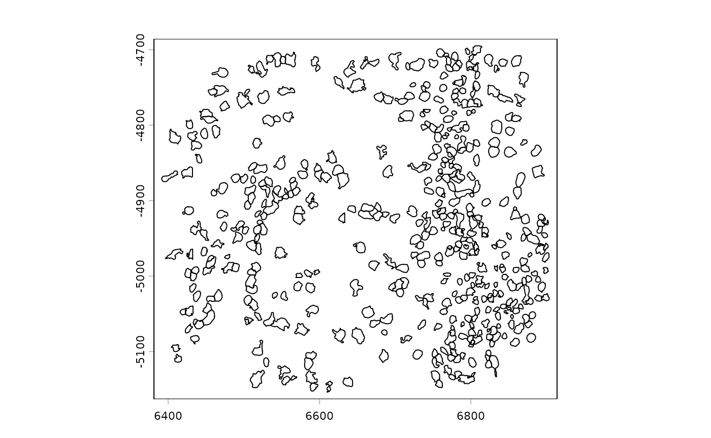
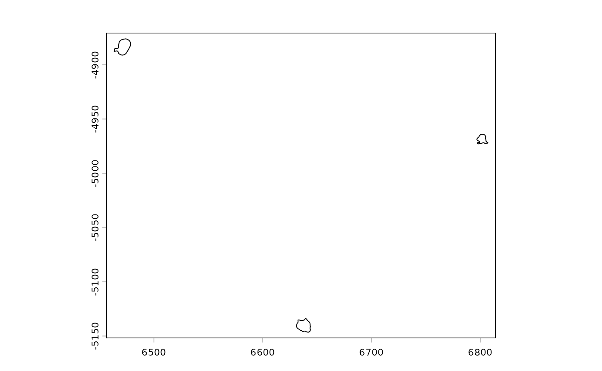
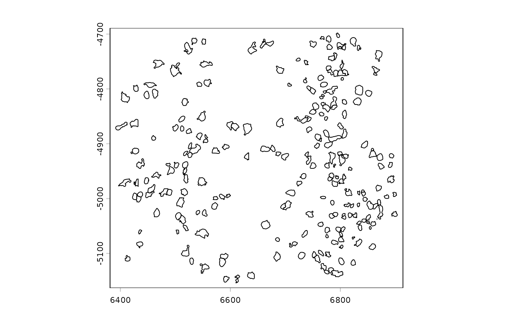
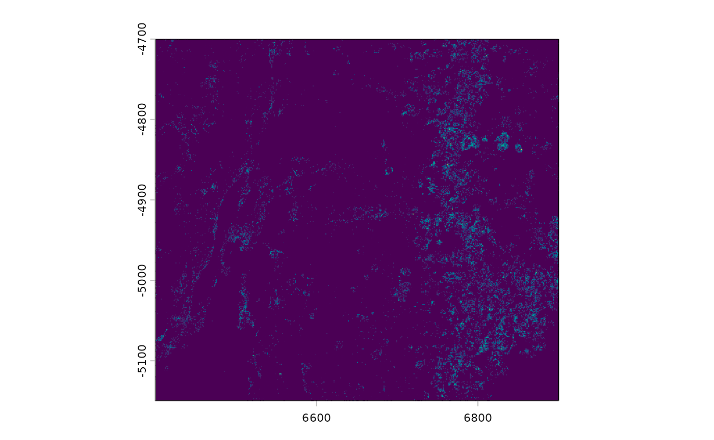
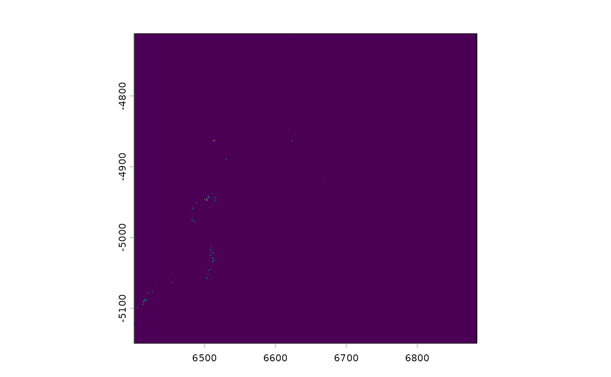

# Giotto spatial geometry classes

## 1. Overview

*GiottoClass* represents spatial polygons and points respectively as S4
classes `giottoPolygon` and `giottoPoints`. These objects are built on
top of *terra* `SpatVectors` in order to represent spatial biology. They
also respond to many of terra’s generics, with some enhancements. Both
objects have a `spatVector` slot that contains the main information.
This common slot is inherited from the `VIRTUAL` `terraVectData` class,
however this naming may be subject to change as other data
representations are added.

The structures of these classes are:

    terraVectData
    \- spatVector

    giottoPolygon
    \- spatVector           (spatial polygons SpatVector)
    \- spatVectorCentroids  (centroids points SpatVector)
    \- overlaps             (list of overlapped features info)
    \- name                 (object name/spat_unit)
    \- unique_ID_cache      (cache of polygon IDs)

    giottoPoints
    \- spatVector           (spatial points SpatVector)
    \- networks             (feature network)
    \- feat_type            (object name/feat_type)
    \- unique_ID_cache      (cache of feature IDs)

Of note are the `unique_ID_cache` slots which are used to get around the
memory usage incurred when frequently accessing the `SpatVectors`
attributes. The caches should be updated after modifications to the
object. This is automatically performed when using `[]` subsetting.

## 2.1 Polygon object creation

[`createGiottoPolygon()`](https://giotto-suite.github.io/GiottoClass/reference/createGiottoPolygon.md)
accepts a number of inputs, including filepaths to spatial files such as
.wkt, .shp, or .GeoJSON or mask image files of common formats such as
.tif or .png. After reading in these files, they are passed to the
respective methods for `SpatVector` and `SpatRaster` (mask image).

`data.frame-like` inputs are also allowed as long as they are formatted
similarly to *terra’s* `matrix` representation of polygon geometries,
with at least the following columns.

- `geom`: integer identifier for each polygon
- `part`: integer identifier for each part of the polygon, in the case
  of a multi polygon
- `x`: numeric x coordinate of a polygon vertex
- `y`: numeric y coordinate of a polygon vertex
- `hole`: integer identifier for each hole within a polygon
- `poly_ID`: standard Giotto identifier for the polygon. Akin to cell_ID

Additional columns can be included as other attributes, but a set of
`poly_ID`s are required.

*For de-novo generation of simple polygon arrays, see the documentation
for
[`polyStamp()`](https://giotto-suite.github.io/GiottoClass/reference/polyStamp.md)
and
[`tessellate()`](https://giotto-suite.github.io/GiottoClass/reference/tessellate.md)*

## 2.2 Points object creation

There are relatively fewer input methods for `giottoPoints` since they
currently tend to be provided as flat files as opposed to
spatial-specific formats.
[`createGiottoPoints()`](https://giotto-suite.github.io/GiottoClass/reference/createGiottoPoints.md)
works with with `data.frame-like` inputs with at least columns for
x-coordinate, y-coordinate, and ID information. The first two detected
numeric columns are expected to be x and y respectively. The first
character column is assumed to be the feat_IDs. *terra* `SpatVector`
inputs are also accepted.

A helpful parameter is `split_keyword` which accepts a list of regex
keywords to pull matched features into separate `giottoPoints` objects.
This is useful in situations where multiple feature modalities and/or QC
targets are provided together and would interfere with each other if
analyzed together. (see examples in
[`createGiottoPoints()`](https://giotto-suite.github.io/GiottoClass/reference/createGiottoPoints.md)
documentation)

## 3. Subsetting

`giottoPoints` and `giottoPolygons` can be subset either by logical
vectors or by ID.

``` r

library(GiottoClass)
gpoly <- GiottoData::loadSubObjectMini("giottoPolygon")
gpoints <- GiottoData::loadSubObjectMini("giottoPoints")

# full objects
print(gpoly)
```

    ## An object of class giottoPolygon
    ## spat_unit : "aggregate"
    ## Spatial Information:
    ## class       : SpatVector
    ## geometry    : polygons
    ## dimensions  : 462, 4  (geometries, attributes)
    ## extent      : 6391.466, 6903.573, -5153.897, -4694.868  (xmin, xmax, ymin, ymax)
    ## coord. ref. : 
    ## names       :                   poly_ID stack agg_n valid
    ## type        :                     <chr> <chr> <int> <int>
    ## values      : 100210519278873141813371~    NA     2     1
    ##               101161259912191124732236~    NA     2     1
    ##               101488859781016188084173~    NA     2     1
    ##               ...
    ##  centroids   : calculated
    ##  overlaps    : rna

``` r

print(gpoints)
```

    ## An object of class giottoPoints
    ## feat_type : "rna"
    ## Feature Information:
    ## class       : SpatVector
    ## geometry    : points
    ## dimensions  : 79761, 3  (geometries, attributes)
    ## extent      : 6400.037, 6900.032, -5149.983, -4699.979  (xmin, xmax, ymin, ymax)
    ## coord. ref. : 
    ## names       : feat_ID global_z feat_ID_uniq
    ## type        :   <chr>    <int>        <int>
    ## values      :    Mlc1        0            1
    ##                Gprc5b        0            2
    ##                  Gfap        0            3
    ##               ...

``` r

# subsets
plot(gpoly)
```



``` r

plot(gpoly[c("100210519278873141813371229408401071444", "101161259912191124732236989250178928032", "101488859781016188084173008420811094152")])
```



``` r

print(gpoly[c("100210519278873141813371229408401071444", "101161259912191124732236989250178928032", "101488859781016188084173008420811094152")])
```

    ## An object of class giottoPolygon
    ## spat_unit : "aggregate"
    ## Spatial Information:
    ## class       : SpatVector
    ## geometry    : polygons
    ## dimensions  : 3, 4  (geometries, attributes)
    ## extent      : 6463.427, 6806.944, -5146.466, -4876.088  (xmin, xmax, ymin, ymax)
    ## coord. ref. : 
    ## names       :                   poly_ID stack agg_n valid
    ## type        :                     <chr> <chr> <int> <int>
    ## values      : 100210519278873141813371~    NA     2     1
    ##               101161259912191124732236~    NA     2     1
    ##               101488859781016188084173~    NA     2     1
    ##  centroids   : calculated
    ##  overlaps    : rna

``` r

plot(gpoly[c(T,F)])
```



``` r

plot(gpoints)
```



``` r

plot(gpoints[c("Fn1")])
```



``` r

print(gpoints[c("Fn1")])
```

    ## An object of class giottoPoints
    ## feat_type : "rna"
    ## Feature Information:
    ## class       : SpatVector
    ## geometry    : points
    ## dimensions  : 814, 3  (geometries, attributes)
    ## extent      : 6400.663, 6884.093, -5149.767, -4711.758  (xmin, xmax, ymin, ymax)
    ## coord. ref. : 
    ## names       : feat_ID global_z feat_ID_uniq
    ## type        :   <chr>    <int>        <int>
    ## values      :     Fn1        0          166
    ##                   Fn1        0          181
    ##                   Fn1        0          195
    ##               ...

`$` extraction can be used to pull attributes of these objects as
vectors

``` r

head(gpoly$poly_ID)
```

    ## [1] "100210519278873141813371229408401071444"
    ## [2] "101161259912191124732236989250178928032"
    ## [3] "101488859781016188084173008420811094152"
    ## [4] "101523780333017320796881555775415156847"
    ## [5] "102184699197574201819246996094734116255"
    ## [6] "102893953956695364131894293580364005295"

## 4. Conversion to data.table

*GiottoClass* has a set of functions for converting `giottoPoints` and
`giottoPolygon` objects between spatial classes using
[`as.sf()`](https://giotto-suite.github.io/GiottoClass/reference/r_spatial_conversions.md),
[`as.sp()`](https://giotto-suite.github.io/GiottoClass/reference/r_spatial_conversions.md),
[`as.stars()`](https://giotto-suite.github.io/GiottoClass/reference/r_spatial_conversions.md),
and
[`as.terra()`](https://giotto-suite.github.io/GiottoClass/reference/r_spatial_conversions.md).
*terra*-based `giottoPoints` and `giottoPolygon` objects can also be
converted into `data.table` for geometry manipulation. This method
largely piggybacks off *terra*’s
[`as.data.frame()`](https://rdrr.io/r/base/as.data.frame.html) and adds
support for `geom = "XY"` for polygon geometry.

``` r

gpoly_dt <- data.table::as.data.table(gpoly, geom = "XY")
gpoints_dt <- data.table::as.data.table(gpoints, geom = "XY")

print(gpoly_dt)
```

    ## Key: <geom>
    ##         geom  part        x         y  hole
    ##        <int> <num>    <num>     <num> <num>
    ##     1:     1     1 6642.257 -5136.674     0
    ##     2:     1     1 6642.711 -5137.020     0
    ##     3:     1     1 6643.050 -5137.462     0
    ##     4:     1     1 6643.310 -5137.956     0
    ##     5:     1     1 6643.484 -5138.518     0
    ##    ---                                     
    ## 35971:   462     1 6788.764 -4942.998     0
    ## 35972:   462     1 6788.905 -4942.999     0
    ## 35973:   462     1 6789.575 -4942.999     0
    ## 35974:   462     1 6789.576 -4943.000     0
    ## 35975:   462     1 6789.695 -4943.000     0
    ##                                        poly_ID  stack agg_n valid
    ##                                         <char> <char> <int> <int>
    ##     1: 100210519278873141813371229408401071444   <NA>     2     1
    ##     2: 100210519278873141813371229408401071444   <NA>     2     1
    ##     3: 100210519278873141813371229408401071444   <NA>     2     1
    ##     4: 100210519278873141813371229408401071444   <NA>     2     1
    ##     5: 100210519278873141813371229408401071444   <NA>     2     1
    ##    ---                                                           
    ## 35971:  98561957902191275233320065611022298397   <NA>     2     1
    ## 35972:  98561957902191275233320065611022298397   <NA>     2     1
    ## 35973:  98561957902191275233320065611022298397   <NA>     2     1
    ## 35974:  98561957902191275233320065611022298397   <NA>     2     1
    ## 35975:  98561957902191275233320065611022298397   <NA>     2     1

``` r

print(gpoints_dt)
```

    ##          feat_ID global_z feat_ID_uniq        x         y
    ##           <char>    <int>        <int>    <num>     <num>
    ##     1:      Mlc1        0            1 6400.037 -4966.651
    ##     2:    Gprc5b        0            2 6400.041 -4965.377
    ##     3:      Gfap        0            3 6400.078 -5081.453
    ##     4:      Gfap        0            4 6400.084 -5038.288
    ##     5:     Ednrb        0            5 6400.172 -4816.516
    ##    ---                                                   
    ## 79757:    Adgra1        1        80339 6900.010 -4773.595
    ## 79758:     Cspg5        1        80340 6900.023 -4772.980
    ## 79759: Adcyap1r1        1        80341 6900.024 -5007.432
    ## 79760:   Slc17a7        1        80342 6900.026 -4924.840
    ## 79761:     Cldn5        1        80343 6900.030 -4746.916

These tables can then be either re-ingested using
[`createGiottoPolygon()`](https://giotto-suite.github.io/GiottoClass/reference/createGiottoPolygon.md)
and
[`createGiottoPoints()`](https://giotto-suite.github.io/GiottoClass/reference/createGiottoPoints.md)
or converted to `SpatVector` using
[`as.polygons()`](https://giotto-suite.github.io/GiottoClass/reference/as.polygons.md)
or
[`as.points()`](https://giotto-suite.github.io/GiottoClass/reference/as.points.md)

``` r

print(as.polygons(gpoly_dt))
```

    ## class       : SpatVector
    ## geometry    : polygons
    ## dimensions  : 462, 4  (geometries, attributes)
    ## extent      : 6391.466, 6903.573, -5153.897, -4694.868  (xmin, xmax, ymin, ymax)
    ## coord. ref. : 
    ## names       :                   poly_ID stack agg_n valid
    ## type        :                     <chr> <chr> <int> <int>
    ## values      : 100210519278873141813371~    NA     2     1
    ##               101161259912191124732236~    NA     2     1
    ##               101488859781016188084173~    NA     2     1
    ##               ...

``` r

# gpoints currently still requires addition of geom, part, and hole cols
gpoints_dt[, geom := 1:.N]
gpoints_dt[, part := 1]
gpoints_dt[, hole := 0]
print(as.points(gpoints_dt))
```

    ## class       : SpatVector
    ## geometry    : points
    ## dimensions  : 79761, 3  (geometries, attributes)
    ## extent      : 6400.037, 6900.032, -5149.983, -4699.979  (xmin, xmax, ymin, ymax)
    ## coord. ref. : 
    ## names       : feat_ID global_z feat_ID_uniq
    ## type        :   <chr>    <int>        <int>
    ## values      :    Mlc1        0            1
    ##                Gprc5b        0            2
    ##                  Gfap        0            3
    ##               ...

## 5. Centroids

Centroids information are carried by `giottoPolygon` objects in the
`spatVectorCentroids` slot. The
[`centroids()`](https://giotto-suite.github.io/GiottoClass/reference/centroids-generic.md)
generic from *terra* pulls from this slot if the information already
exists. Otherwise, it calculates and returns a set of centroids for the
polygons as `SpatVector` points. The `append_gpolygon` param makes it so
that the `giottoPolygon` with the centroids info appended is returned
instead.

## 6.1 Overlaps

Overlaps are sets of features overlapped by the polygons.
`calculateOverlaps()` is a generic function that performs this
overlapping between polygons and points and polygons and raster
(intensity) data.

``` r

gpoly@overlaps <- NULL # reset overlaps info
gpoly <- calculateOverlap(gpoly, gpoints, verbose = FALSE)

gimg <- GiottoData::loadSubObjectMini("giottoLargeImage")
gpoly <- calculateOverlap(gpoly, gimg, verbose = FALSE, progress = FALSE)
```

Overlaps are stored as a `list` under the `giottoPolygon` `overlaps`
slot, separated by modalities. This list can be retrieved using
[`overlaps()`](https://giotto-suite.github.io/GiottoClass/reference/overlaps-generic.md).
In the case of overlapped points geometries, the list items are points
`SpatVector` objects. The `poly_ID` column tracks which polygon is
overlapping the point feature as designated by `feat_ID` and
`feat_ID_uniq`. `NA` values mean that the feature was not overlapped.

For overlaps intensities, the results are stored as `data.tables` in a
nested `list` called `intensity` under the main `overlaps` `list`.

``` r

print(gpoly@overlaps$rna)
```

    ## <overlapPointDT>
    ## spat_unit : "aggregate"
    ## feat_type : "rna"
    ## provenance: aggregate 
    ## * polygons : 462
    ## * features : 79761
    ## * relations: 35268

``` r

print(gpoly@overlaps$intensity)
```

    ## $dapi_z0
    ## <overlapIntensityDT>
    ## spat_unit : "aggregate"
    ## feat_type : "dapi_z0"
    ## provenance: aggregate 
    ##                                      poly_ID mini_dataset_dapi_z0
    ##                                       <char>                <num>
    ##   1: 100210519278873141813371229408401071444             514207.8
    ##   2: 101161259912191124732236989250178928032             576698.0
    ##   3: 101488859781016188084173008420811094152             593017.6
    ##   4: 101523780333017320796881555775415156847             292254.4
    ##   5: 102184699197574201819246996094734116255             386535.3
    ##  ---                                                             
    ## 458:   9677424102111816817518421117250891895             254194.3
    ## 459:  97068595823890802071024838798130036179             381228.5
    ## 460:  97411078642927912684859796714759494710             509129.4
    ## 461:   9816437869021910185567097363182418837             582503.4
    ## 462:  98561957902191275233320065611022298397             701973.7
    ## * use `[]` to drop to `data.table`

## 6.2 Overlaps to matrix

Overlap results can be converted into expression matrices using
[`overlapToMatrix()`](https://giotto-suite.github.io/GiottoClass/reference/overlapToMatrix.md)

``` r

# points, rna modality (default)
rna_mat <- overlapToMatrix(gpoly)
print(rna_mat[1:3,1:3])
```

    ## 3 x 3 sparse Matrix of class "dgCMatrix"
    ##       1132915601442719251817312578799507532
    ## Abcc9                                     .
    ## Ackr1                                     .
    ## Ackr3                                     .
    ##       1900302715660571356090444774019116326
    ## Abcc9                                     .
    ## Ackr1                                     .
    ## Ackr3                                     .
    ##       2467888014556719520437642348850497467
    ## Abcc9                                     .
    ## Ackr1                                     .
    ## Ackr3                                     .

``` r

# intensity, dapi_z0
intens_mat <- overlapToMatrix(gpoly, type = "intensity", feat_info = "dapi_z0")
print(intens_mat[1, 1:3, drop = FALSE])
```

    ## 1 x 3 Matrix of class "dgeMatrix"
    ##                      1132915601442719251817312578799507532
    ## mini_dataset_dapi_z0                              542906.3
    ##                      1900302715660571356090444774019116326
    ## mini_dataset_dapi_z0                              811641.8
    ##                      2467888014556719520437642348850497467
    ## mini_dataset_dapi_z0                              533609.1

``` r

sessionInfo()
```

    ## R version 4.6.0 (2026-04-24)
    ## Platform: x86_64-pc-linux-gnu
    ## Running under: Ubuntu 24.04.4 LTS
    ## 
    ## Matrix products: default
    ## BLAS:   /usr/lib/x86_64-linux-gnu/openblas-pthread/libblas.so.3 
    ## LAPACK: /usr/lib/x86_64-linux-gnu/openblas-pthread/libopenblasp-r0.3.26.so;  LAPACK version 3.12.0
    ## 
    ## locale:
    ##  [1] LC_CTYPE=C.UTF-8       LC_NUMERIC=C           LC_TIME=C.UTF-8       
    ##  [4] LC_COLLATE=C.UTF-8     LC_MONETARY=C.UTF-8    LC_MESSAGES=C.UTF-8   
    ##  [7] LC_PAPER=C.UTF-8       LC_NAME=C              LC_ADDRESS=C          
    ## [10] LC_TELEPHONE=C         LC_MEASUREMENT=C.UTF-8 LC_IDENTIFICATION=C   
    ## 
    ## time zone: UTC
    ## tzcode source: system (glibc)
    ## 
    ## attached base packages:
    ## [1] stats     graphics  grDevices utils     datasets  methods   base     
    ## 
    ## other attached packages:
    ## [1] GiottoClass_0.5.1
    ## 
    ## loaded via a namespace (and not attached):
    ##  [1] sass_0.4.10          generics_0.1.4       class_7.3-23        
    ##  [4] KernSmooth_2.23-26   gtools_3.9.5         lattice_0.22-9      
    ##  [7] digest_0.6.39        magrittr_2.0.5       evaluate_1.0.5      
    ## [10] grid_4.6.0           fastmap_1.2.0        jsonlite_2.0.0      
    ## [13] Matrix_1.7-5         e1071_1.7-17         backports_1.5.1     
    ## [16] DBI_1.3.0            GiottoData_0.2.16    codetools_0.2-20    
    ## [19] textshaping_1.0.5    jquerylib_0.1.4      cli_3.6.6           
    ## [22] rlang_1.2.0          units_1.0-1          XVector_0.52.0      
    ## [25] Biobase_2.72.0       cachem_1.1.0         yaml_2.3.12         
    ## [28] otel_0.2.0           tools_4.6.0          raster_3.6-32       
    ## [31] GiottoUtils_0.2.5    checkmate_2.3.4      BiocGenerics_0.58.1 
    ## [34] exactextractr_0.10.1 R6_2.6.1             stats4_4.6.0        
    ## [37] proxy_0.4-29         lifecycle_1.0.5      classInt_0.4-11     
    ## [40] S4Vectors_0.50.1     fs_2.1.0             htmlwidgets_1.6.4   
    ## [43] IRanges_2.46.0       ragg_1.5.2           desc_1.4.3          
    ## [46] pkgdown_2.2.0        terra_1.9-27         bslib_0.11.0        
    ## [49] data.table_1.18.4    Rcpp_1.1.1-1.1       sf_1.1-1            
    ## [52] systemfonts_1.3.2    xfun_0.57            knitr_1.51          
    ## [55] htmltools_0.5.9      rmarkdown_2.31       compiler_4.6.0      
    ## [58] sp_2.2-1
