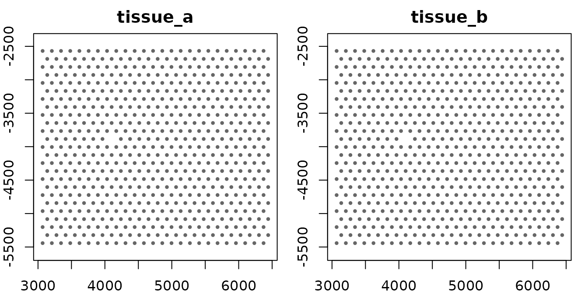
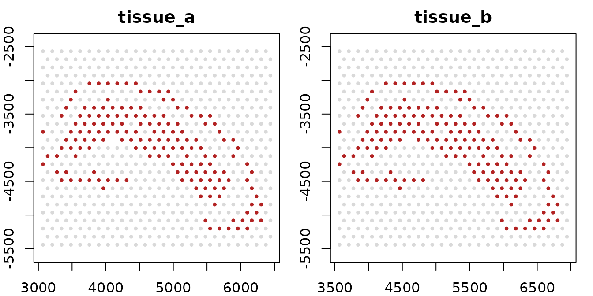
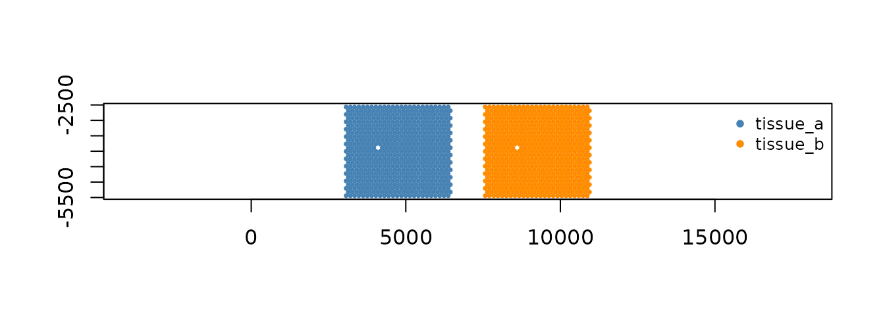

# giottoMulti: working with several samples

A `giottoMulti` holds several `giotto` objects — one per sample — and
lets you analyze them together without merging them. Each sample keeps
its own spatial data and coordinate frame. What the samples share, such
as a joint expression matrix, joint metadata or an integrated embedding,
lives on the multi.

Use one when the samples share a feature panel and you want joint
analysis across them while still being able to address, plot and edit
each sample on its own. If the samples are really one specimen and you
want a single coordinate system,
[`joinGiottoObjects()`](https://giotto-suite.github.io/GiottoClass/dev/reference/joinGiottoObjects.md)
is the better fit; see the comparison at the end.

## Building one

[`createGiottoMulti()`](https://giotto-suite.github.io/GiottoClass/dev/reference/createGiottoMulti.md)
takes a named list of `giotto` objects. The names become the sample
names.

``` r

library(GiottoClass)

mg <- createGiottoMulti(list(
    tissue_a = GiottoData::loadGiottoMini("visium", verbose = FALSE),
    tissue_b = GiottoData::loadGiottoMini("visium", verbose = FALSE)
))
mg
#> An object of class giottoMulti
#>   2 child object(s):
#>     tissue_a: 624 cells, 634 features
#>     tissue_b: 624 cells, 634 features
#>   view: 1248 / 1248 cells, 634 / 634 features
#>   spat_unit: cell (2)
#>   feat_type: rna (2)
#>   values: raw (2)
```

The two samples here are copies of the same mini dataset, which keeps
the example small; everything below works the same with genuinely
different samples.

A multi behaves like a named list of its samples:

``` r

names(mg)
#> [1] "tissue_a" "tissue_b"
length(mg)
#> [1] 2

g_a <- mg[["tissue_a"]]   # one sample, as a plain giotto
class(g_a)
#> [1] "giotto"
#> attr(,"package")
#> [1] "GiottoClass"
```

## Cell IDs are qualified by sample

Two samples can contain the same cell ID, so the multi refers to cells
as `sample::cell_ID`:

``` r

head(spatIDs(mg), 3)
#> [1] "tissue_a::AAAGGGATGTAGCAAG-1" "tissue_a::AAATGGCATGTCTTGT-1"
#> [3] "tissue_a::AAATGGTCAATGTGCC-1"
head(spatIDs(mg, local = TRUE), 3)          # the IDs inside each sample
#> [1] "AAAGGGATGTAGCAAG-1" "AAATGGCATGTCTTGT-1" "AAATGGTCAATGTGCC-1"
length(spatIDs(mg, object = "tissue_b"))    # one sample's cells
#> [1] 624
```

Feature IDs are shared across samples, so they are not qualified.

## Reading data

The getters work on a multi as they do on a `giotto`, with a `samples =`
argument to pick which samples to read.

**Tabular data** — cell metadata, expression, feature metadata — comes
back as one joint table across the samples. Cell metadata carries a
`list_ID` column naming each cell’s sample:

``` r

cm <- getCellMetadata(mg, output = "data.table")
dim(cm)
#> [1] 1248    8
table(cm$list_ID)
#> 
#> tissue_a tissue_b 
#>      624      624

expr <- getExpression(mg, output = "matrix")
dim(expr)
#> [1]  634 1248

dim(getExpression(mg, output = "matrix", samples = "tissue_a"))
#> [1] 634 624
```

**Spatial data** — locations, polygons, points, images, spatial networks
— belongs to one sample each, so it comes back as a named list with one
entry per sample:

``` r

locs <- getSpatialLocations(mg)
names(locs)
#> [1] "tissue_a" "tissue_b"

locs_a <- getSpatialLocations(mg, samples = "tissue_a")[["tissue_a"]]
locs_a
#> An object of class spatLocsObj : "raw"
#> spat_unit : "cell"
#> provenance: cell 
#> dimensions: 624 3 
#> preview   :
#>    sdimx sdimy            cell_ID
#>    <int> <int>             <char>
#> 1:  5477 -4125 AAAGGGATGTAGCAAG-1
#> 2:  5959 -2808 AAATGGCATGTCTTGT-1
#> 3:  4720 -5202 AAATGGTCAATGTGCC-1
#> 
#> ranges:
#>      sdimx sdimy
#> [1,]  3069 -5442
#> [2,]  6441 -2568
```

A small helper draws the spatial locations it is given, one panel per
sample. It is reused below:

``` r

plot_samples <- function(locs, highlight = NULL, ...) {
    op <- par(mfrow = c(1, length(locs)), mar = c(2, 2, 2, 1))
    on.exit(par(op))
    for (nm in names(locs)) {
        xy <- locs[[nm]][]
        plot(xy$sdimx, xy$sdimy, pch = 16, cex = 0.6, asp = 1,
            col = if (is.null(highlight)) "grey40" else
                ifelse(xy$cell_ID %in% highlight[[nm]], "firebrick", "grey85"),
            main = nm, xlab = "", ylab = "", ...)
    }
}

plot_samples(getSpatialLocations(mg))
```



## Naming a set of samples: groups

A group is a name for several samples. Once registered, it works
anywhere a sample name does:

``` r

gmultiGroup(mg, "pair") <- c("tissue_a", "tissue_b")
gmultiGroups(mg)
#> [1] "pair"

nrow(getCellMetadata(mg, output = "data.table", samples = "pair"))
#> [1] 1248
```

Groups resolve when they are used, so a group keeps up as samples are
added, renamed or removed. A group and a sample cannot share a name.

## How samples line up: the mapping

A multi needs to know which content in each sample belongs together —
which spatial unit, which feature type, which expression matrix. That is
the mapping, and it is filled in automatically when the multi is built:

``` r

gmultiMapping(mg, "values")
#> $raw
#> tissue_a tissue_b 
#>    "raw"    "raw"
```

Each entry maps a name at the multi level to the name each sample uses.
Here both samples call their raw counts `"raw"`. If one sample used a
different name, say `"counts"`, you would say so once, and every joint
read would use it:

``` r

gmultiMapping(mg, "values", "raw") <- c(tissue_a = "raw", tissue_b = "counts")
```

An `NA` entry means a sample deliberately does not contribute to that
handle. A sample that is supposed to contribute but cannot is an error
when the data is read, naming the sample.

## Joint data and per-sample data

Joint tables are assembled from the samples the first time they are
read. Anything written to the multi goes to the joint level and leaves
the samples alone:

``` r

ids <- spatIDs(mg)
mg <- addCellMetadata(mg,
    new_metadata = data.table::data.table(
        cell_ID = ids,
        batch = ifelse(startsWith(ids, "tissue_a"), "batch1", "batch2")),
    by_column = TRUE, column_cell_ID = "cell_ID")

table(getCellMetadata(mg, output = "data.table")$batch)
#> 
#> batch1 batch2 
#>    624    624
"batch" %in% names(getCellMetadata(mg[["tissue_a"]], output = "data.table"))
#> [1] FALSE
```

Spatial data has no joint level, so it cannot be written through the
multi:

``` r

setSpatialLocations(mg, locs_a)
#> Error:
#> ! [gmulti setSpatialLocations] a giottoMulti has no multi-level slot for spatial locations, deliberately: each one belongs to exactly one sample, so holding it here would make its owning sample a `sample::` prefix rather than where it lives. Write into the child and put the child back:
#>   g <- mg[["<sample>"]]
#>   g <- setSpatialLocations(g, x, ...)
#>   mg[["<sample>"]] <- g
```

To change one sample, take it out, edit it, and put it back:

``` r

g <- mg[["tissue_b"]]
g <- spatShift(g, dx = 500)
mg[["tissue_b"]] <- g

range(getSpatialLocations(mg, samples = "tissue_b")[[1]][]$sdimx)
#> [1] 3569 6941
```

## Narrowing

[`subset()`](https://rdrr.io/r/base/subset.html) narrows the multi. With
`cells =` it keeps those cells in the joint analysis; with `samples =`
it keeps those samples, the same as `mg[...]`:

``` r

mg_small <- subset(mg, cells = head(spatIDs(mg), 100))
length(spatIDs(mg_small))
#> [1] 100

names(subset(mg, samples = "tissue_a"))
#> [1] "tissue_a"
names(mg["tissue_b"])
#> [1] "tissue_b"
```

Narrowing by cell leaves each sample’s own spatial data untouched, so
the full tissue is still there if you need it:

``` r

length(spatIDs(mg_small[["tissue_a"]]))
#> [1] 624
```

[`subset()`](https://rdrr.io/r/base/subset.html) returns a new object;
the original `mg` is unchanged.

## Views: narrowing without changing the object

A view records a narrowing under a name instead of applying it. Build
one with the usual verbs and a `view =` argument, then read through it
with any getter:

``` r

mg <- subset(mg, leiden_clus == 1, view = "cluster1")

nrow(getCellMetadata(mg, output = "data.table"))
#> [1] 1248
nrow(getCellMetadata(mg, output = "data.table", view = "cluster1"))
#> [1] 324
```

The same view narrows spatial reads, per sample:

``` r

c1 <- getSpatialLocations(mg, view = "cluster1")
plot_samples(getSpatialLocations(mg),
    highlight = lapply(c1, function(x) x[]$cell_ID))
```



A view can also select samples. With `samples =` and `view =`,
[`subset()`](https://rdrr.io/r/base/subset.html) records a sample step,
and reads through the view skip the other samples entirely. One call can
record both a sample step and a filter:

``` r

mg <- subset(mg, leiden_clus == 1, samples = "tissue_b", view = "b_cluster1")

names(getSpatialLocations(mg, view = "b_cluster1"))
#> [1] "tissue_b"
table(getCellMetadata(mg, output = "data.table", view = "b_cluster1")$list_ID)
#> 
#> tissue_b 
#>      162
```

Views travel with the object and can be copied between objects. See
[`vignette("view_and_space", package = "GiottoClass")`](https://giotto-suite.github.io/GiottoClass/dev/articles/view_and_space.md)
for crops, the other step kinds, and how views are stored.

## Spaces: laying samples out

A space records coordinate transforms under a name. On a multi,
`samples =` says which samples a transform moves, which is how you build
a layout. Here `tissue_b` is moved beside `tissue_a` without changing
either sample’s data:

``` r

mg <- spatShift(mg, dx = 4000, space = "side_by_side", samples = "tissue_b")

laid_out <- getSpatialLocations(mg, space = "side_by_side")
xy <- rbind(
    cbind(laid_out$tissue_a[], sample = "tissue_a"),
    cbind(laid_out$tissue_b[], sample = "tissue_b"))
plot(xy$sdimx, xy$sdimy, pch = 16, cex = 0.5, asp = 1,
    col = ifelse(xy$sample == "tissue_a", "steelblue", "darkorange"),
    xlab = "", ylab = "")
legend("topright", legend = c("tissue_a", "tissue_b"), pch = 16,
    col = c("steelblue", "darkorange"), bty = "n", cex = 0.8)
```



``` r


range(getSpatialLocations(mg, samples = "tissue_b")[[1]][]$sdimx)   # native
#> [1] 3569 6941
```

A space built this way gives each sample its own copy of the frame, so
the samples stay independent: a job over it is one job per sample. When
the samples should share one coordinate system — so that distances
between them mean something — declare a combined space first, naming its
members:

``` r

giottoSpace(mg, "atlas") <- combinedSpace(c("tissue_a", "tissue_b"))
mg <- spatShift(mg, dx = 4000, space = "atlas", samples = "tissue_b")
giottoSpace(mg, "atlas")
#> An object of class combinedSpace
#> space 'atlas' | 2 sample(s) share one coordinate system
#>   members : tissue_a, tissue_b 
#>   steps   : member{tissue_a,tissue_b} -> spatShift[tissue_b]
```

Views and spaces combine: the view picks the cells, the space places
them.

``` r

placed <- getSpatialLocations(mg, view = "cluster1", space = "side_by_side")
sapply(placed, function(x) c(cells = nrow(x[]), range(x[]$sdimx)))
#>       tissue_a tissue_b
#> cells      162      162
#>           3069     7569
#>           6303    10803
```

## Analysis and plotting

The analysis functions in the Giotto package — normalization, dimension
reduction, clustering, integration — work on a multi’s joint expression
and write their results to its joint slots, alongside the per-sample
data.

Plotting lives in GiottoVisuals. Spatial plots draw one panel per sample
and take the same `samples =`, `view =` and `space =` arguments as the
getters. Non-spatial plots (UMAP, violin, dot plots) draw one plot
across all samples; color by `list_ID` to tell them apart:

``` r

GiottoVisuals::spatPlot2D(mg, samples = "pair", view = "cluster1")
GiottoVisuals::spatPlot2D(mg, space = "atlas")
GiottoVisuals::plotUMAP(mg, cell_color = "list_ID")
```

## `giottoMulti` or `joinGiottoObjects()`?

Both put several samples into one workflow. They differ in what they
keep.

|  | `giottoMulti` | [`joinGiottoObjects()`](https://giotto-suite.github.io/GiottoClass/dev/reference/joinGiottoObjects.md) |
|----|----|----|
| Each sample addressable by name | yes: `samples =`, groups | no: merged into one object |
| Spatial data | stays with each sample, in its own frame | merged, with coordinate offsets |
| A sample on its own | `mg[["name"]]` is a full `giotto` | not recoverable |
| Laying samples out | recorded spaces, changeable later | fixed at join time |
| Joint analysis | joint slots on the multi | the one object |

Pick `giottoMulti` when sample identity matters through the analysis —
QC, normalization, integration, per-sample plots, cohort comparisons.
Pick
[`joinGiottoObjects()`](https://giotto-suite.github.io/GiottoClass/dev/reference/joinGiottoObjects.md)
when the samples really are one specimen and you want a single
coordinate system.

## See also

- [`vignette("view_and_space", package = "GiottoClass")`](https://giotto-suite.github.io/GiottoClass/dev/articles/view_and_space.md)
  — views and spaces in depth.
- `vignettes/articles/design_gmulti.Rmd` — why `giottoMulti` is built
  the way it is.
- [`?createGiottoMulti`](https://giotto-suite.github.io/GiottoClass/dev/reference/createGiottoMulti.md),
  [`?gmultiGroup`](https://giotto-suite.github.io/GiottoClass/dev/reference/gmultiGroup.md),
  [`?gmultiMapping`](https://giotto-suite.github.io/GiottoClass/dev/reference/gmultiMapping.md),
  [`?"subset-giottoMulti"`](https://giotto-suite.github.io/GiottoClass/dev/reference/subset-giottoMulti.md).
